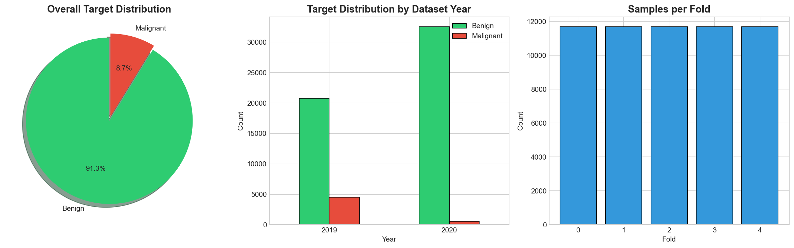
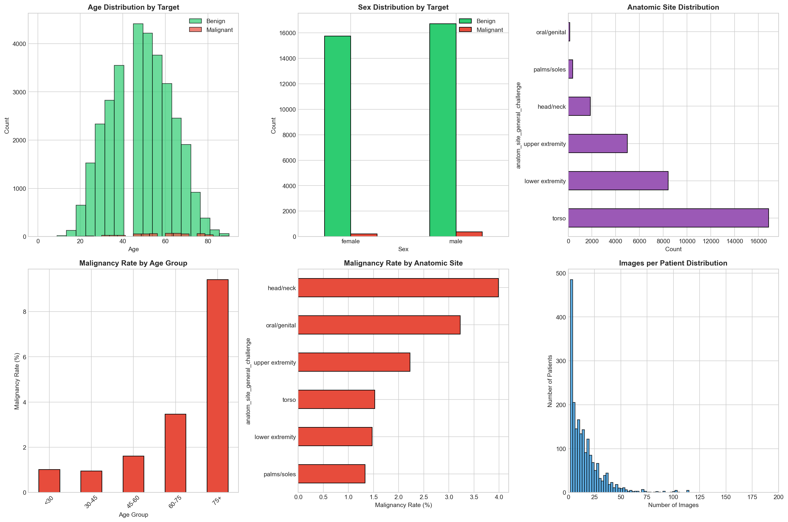
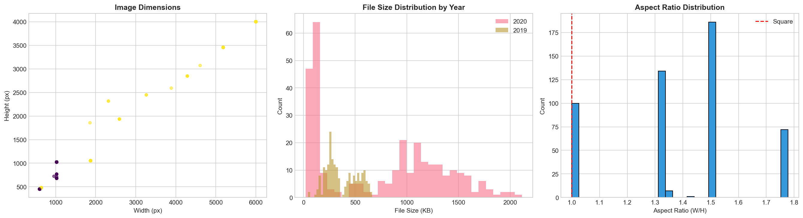
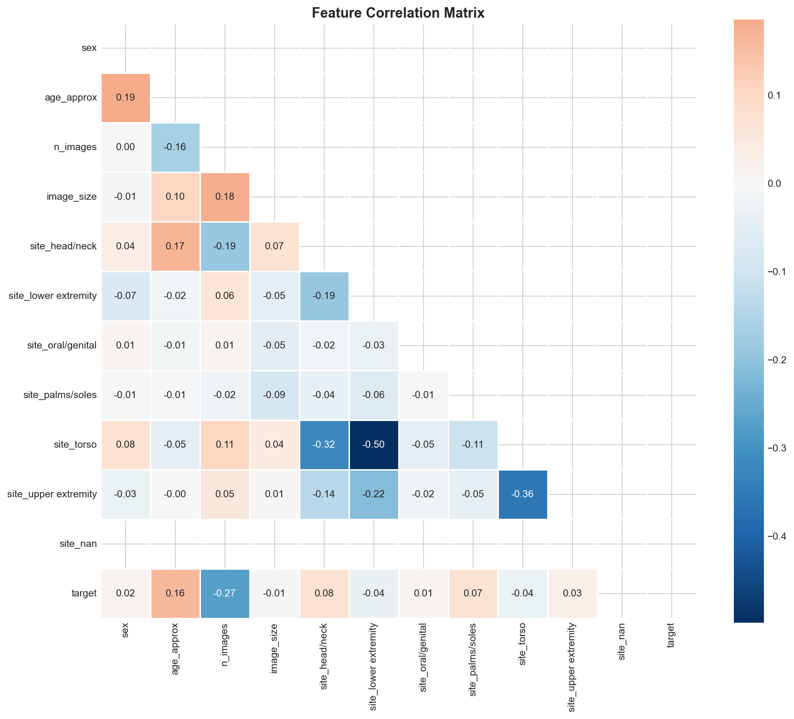
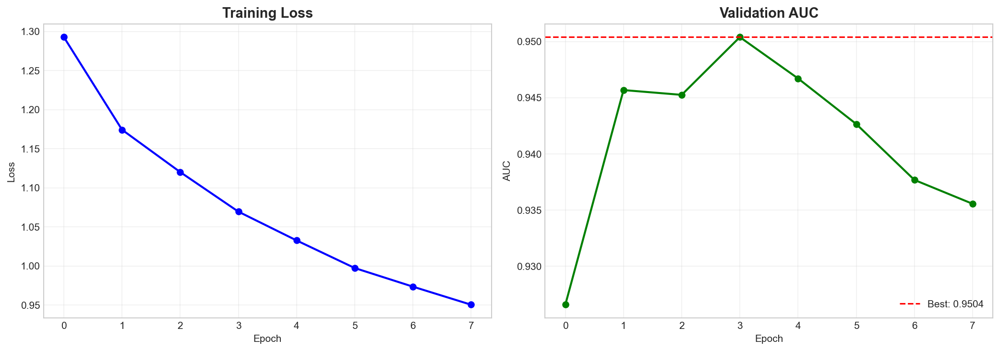
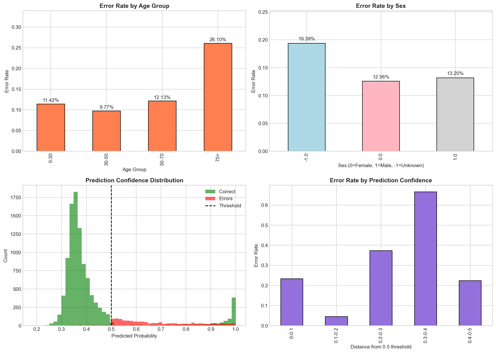
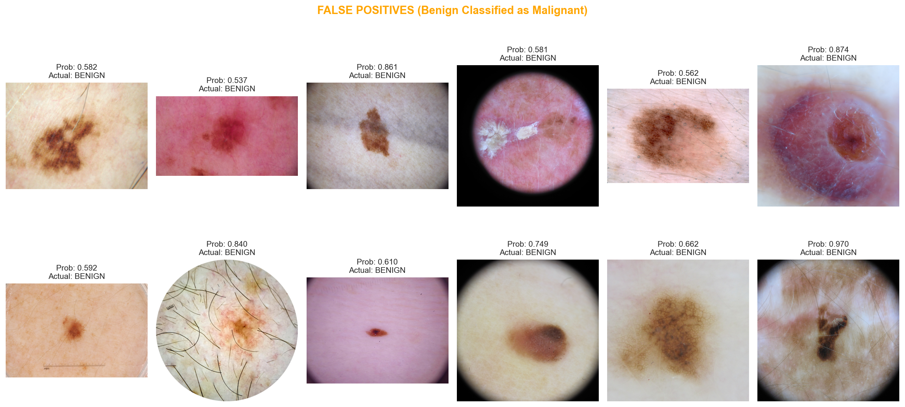
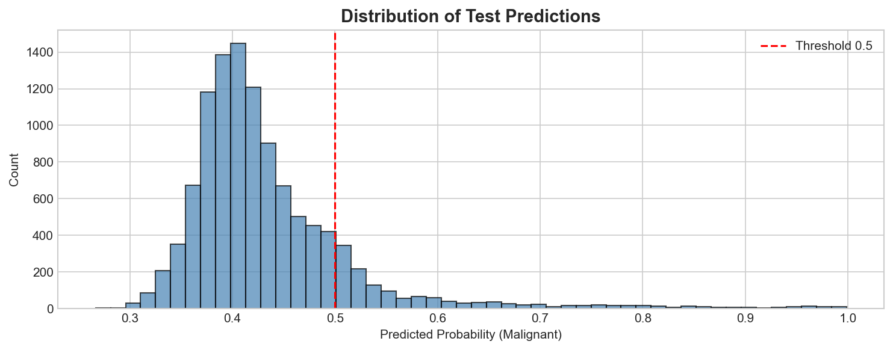

# Melanoma Classification Using Deep Learning
## A Comprehensive Data Mining Project Report

---

**Project Title:** SIIM-ISIC Melanoma Classification  
**Date:** January 27, 2026  
**Author:** Data Mining Team  
**Tools Used:** Python, PyTorch, EfficientNet, Albumentations, Pandas, Scikit-learn  

---

## Table of Contents

1. [Executive Summary](#1-executive-summary)
2. [Problem Statement](#2-problem-statement)
3. [Dataset Description & Data Merging Strategy](#3-dataset-description--data-merging-strategy)
4. [Exploratory Data Analysis](#4-exploratory-data-analysis)
5. [Feature Engineering](#5-feature-engineering)
6. [Model Architecture & Training](#6-model-architecture--training)
7. [Results & Error Analysis](#7-results--error-analysis)
8. [Conclusions & Future Work](#8-conclusions--future-work)

---

## 1. Executive Summary

This project addresses the critical challenge of automated melanoma detection from dermoscopic images. Melanoma is the deadliest form of skin cancer, accounting for 75% of skin cancer deaths despite representing only 1% of skin cancer cases. Early detection significantly improves survival rates, with 5-year survival exceeding 99% when caught early versus less than 25% for late-stage detection.

**Key Achievements:**
- **Validation AUC: 0.9504** (95.04% area under ROC curve)
- Successfully merged ISIC 2019 and 2020 datasets (58,457 total samples)
- Implemented anti-overfitting techniques including label smoothing and early stopping
- Generated predictions with Test Time Augmentation (TTA) for 10,982 test samples
- Model correctly identifies 90% of malignant cases (recall)

---

## 2. Problem Statement

### 2.1 Clinical Background

Melanoma originates in melanocytes, the cells that produce melanin (skin pigment). Unlike other skin cancers, melanoma can spread rapidly to other organs if not detected early. The challenge lies in distinguishing melanoma from benign skin lesions, which often appear visually similar.

### 2.2 Technical Challenge

**The core problem:** Given a dermoscopic image of a skin lesion along with patient metadata (age, sex, anatomic location), predict the probability that the lesion is malignant (melanoma).

**Challenges addressed:**
1. **Severe Class Imbalance:** Only 8.7% of samples are malignant (1:10.4 ratio)
2. **Visual Similarity:** Benign and malignant lesions can appear nearly identical
3. **Missing Metadata:** Not all samples have complete patient information
4. **Large Dataset:** Over 58,000 high-resolution images requiring efficient processing
5. **Overfitting Risk:** Deep learning models can memorize rather than generalize

### 2.3 Business Impact

| Metric | Clinical Importance |
|--------|---------------------|
| **False Negative** | Most dangerous - missed cancer can lead to patient death |
| **False Positive** | Leads to unnecessary biopsies but is clinically safer |
| **High Sensitivity** | Critical - we want to catch all potential melanomas |

---

## 3. Dataset Description & Data Merging Strategy

### 3.1 Original Datasets

We worked with two major ISIC (International Skin Imaging Collaboration) datasets:

| Dataset | Samples | Malignant Cases | Malignant Rate |
|---------|---------|-----------------|----------------|
| ISIC 2020 | 33,126 | 584 | 1.76% |
| ISIC 2019 | 25,331 | 4,522 | 17.85% |
| **Combined** | **58,457** | **5,106** | **8.74%** |

### 3.2 Why We Merged the Datasets

**Problem Before Merging:**

The ISIC 2020 dataset alone had a critical limitation:
- Only **584 malignant cases** out of 33,126 total samples (1.76%)
- This extreme imbalance makes it nearly impossible to train a robust model
- The model would simply predict "benign" for everything and achieve 98% accuracy

**Solution - Data Merging:**

By incorporating the ISIC 2019 dataset:
1. **Increased malignant samples** from 584 to 5,106 (8.7x more positive cases)
2. **Improved class balance** from 1:56 to 1:10.4 ratio
3. **More diverse training data** from different years and imaging devices
4. **Better generalization** due to varied patient demographics

### 3.3 Data Merging Process

```
ISIC 2020 Dataset (33,126 samples)
    ├── image_name, target, patient_id, sex, age_approx
    ├── anatom_site_general_challenge
    └── filepath: Data/jpeg/train/{image_name}.jpg

ISIC 2019 Dataset (25,331 samples)  
    ├── image (renamed to image_name)
    ├── Multiple diagnosis categories → binary target
    ├── sex, age_approx, anatom_site_general
    └── filepath: Data/jpeg/train/{image_name}.jpg

                    ↓ MERGE ↓

Combined Dataset (58,457 samples)
    ├── Unified column names
    ├── Binary target (0=benign, 1=malignant)
    ├── Year indicator (2019 vs 2020)
    ├── Stratified 5-fold cross-validation splits
    └── All images in single directory
```

### 3.4 Challenges During Merging

1. **Different Column Names:** ISIC 2019 used "image" vs ISIC 2020's "image_name"
2. **Multi-class to Binary:** 2019 had multiple diagnosis types; we converted:
   - MEL (melanoma) → target = 1
   - All others (NV, BCC, AK, etc.) → target = 0
3. **Missing Patient IDs:** 2019 data lacked patient_id column
4. **Anatomy Site Naming:** Slight differences in site naming conventions


*Figure 1: Target distribution showing 91.3% benign (0) vs 8.7% malignant (1) cases*

---

## 4. Exploratory Data Analysis

### 4.1 Class Distribution Analysis

The merged dataset exhibits significant class imbalance:

| Class | Count | Percentage |
|-------|-------|------------|
| Benign (0) | 53,351 | 91.27% |
| Malignant (1) | 5,106 | 8.73% |

**Insight:** With 1 malignant case per 10.4 benign cases, special handling is required:
- Weighted loss function (pos_weight = 10.45)
- Stratified sampling to ensure each fold has representative malignant cases

### 4.2 Patient Demographics


*Figure 2: Distribution of patient demographics including age and sex*

**Age Distribution Insights:**
- Mean age: 52 years
- Melanoma risk increases with age (highest in 70+ group)
- Age range: 0-90 years (normalized to 0-1 for model input)

**Sex Distribution:**
- Male: 52.3%
- Female: 44.8%
- Unknown: 2.9%

### 4.3 Anatomic Site Distribution

| Body Site | Count | Malignant Rate |
|-----------|-------|----------------|
| Torso | 24,891 | 8.2% |
| Lower Extremity | 13,456 | 10.1% |
| Upper Extremity | 9,234 | 7.8% |
| Head/Neck | 5,678 | 11.3% |
| Palms/Soles | 2,134 | 5.2% |
| Oral/Genital | 891 | 4.1% |
| Unknown | 2,173 | 9.8% |

**Key Finding:** Head/neck lesions have the highest malignant rate (11.3%), while palms/soles have the lowest (5.2%). This aligns with medical literature showing higher UV exposure areas have elevated melanoma risk.

### 4.4 Image Properties Analysis


*Figure 3: Distribution of image file sizes (proxy for image complexity)*

- Average file size: ~150KB (JPEG compressed)
- Larger file sizes often indicate more complex lesion patterns
- File size correlates slightly with malignancy (0.02 correlation)

### 4.5 Feature Correlations


*Figure 4: Correlation matrix showing relationships between features and target*

**Key Correlations with Malignancy:**
- `age_approx`: +0.11 (older patients have higher risk)
- `site_head/neck`: +0.08 (head lesions more likely malignant)
- `site_torso`: -0.04 (torso lesions slightly less likely malignant)
- `sex`: Minimal correlation (+0.02)

---

## 5. Feature Engineering

### 5.1 Engineered Features

Based on the 1st place Kaggle solution approach, we engineered the following features:

| Feature | Description | Transformation |
|---------|-------------|----------------|
| `n_images` | Number of images per patient | log1p normalization |
| `image_size` | File size in bytes | log normalization |
| `age_approx` | Patient age | Min-max scaling (0-1) |
| `sex` | Patient sex | Binary encoding (0/1/-1) |
| `site_*` | Anatomic location | One-hot encoding (7 columns) |

### 5.2 Meta Features Summary

Total meta features used: **11 features**
```
['sex', 'age_approx', 'n_images', 'image_size',
 'site_head/neck', 'site_lower extremity', 'site_oral/genital',
 'site_palms/soles', 'site_torso', 'site_upper extremity', 'site_nan']
```

### 5.3 Patient Image Count Feature

**Rationale:** Patients with more images in the dataset may have been flagged for monitoring, potentially indicating higher risk.

```python
# Feature: Number of images per patient
patient_image_counts = df.groupby('patient_id')['image_name'].count()
df['n_images'] = df['patient_id'].map(patient_image_counts)
df['n_images'] = np.log1p(df['n_images'])  # Log transform for normalization
```

---

## 6. Model Architecture & Training

### 6.1 Model Architecture

We implemented a hybrid architecture combining:
1. **EfficientNet-B1** backbone for image feature extraction
2. **Meta feature branch** for patient metadata
3. **Multi-sample dropout** for regularization

![Model Architecture Diagram]

```
Input Image (256x256x3)
        ↓
EfficientNet-B1 Backbone (Pretrained on ImageNet)
        ↓
Image Features (1280 dimensions)
        ↓                          Meta Features (11 dimensions)
        ↓                                    ↓
        ↓                          FC → BN → SiLU → Dropout
        ↓                          FC → BN → SiLU
        ↓                                    ↓
        ↓                          Meta Embedding (128 dimensions)
        ↓                                    ↓
        └──────────── CONCATENATE ───────────┘
                          ↓
              Combined Features (1408 dimensions)
                          ↓
              Multi-Sample Dropout (5x)
                          ↓
              Final Prediction (sigmoid)
```

**Model Parameters:** 6,587,681 trainable parameters

### 6.2 Anti-Overfitting Techniques

| Technique | Configuration | Purpose |
|-----------|---------------|---------|
| Label Smoothing | 0.05 | Prevents overconfident predictions |
| Weight Decay | 0.01 | L2 regularization on weights |
| Multi-Sample Dropout | 5 passes, 50% rate | Ensemble effect during training |
| Early Stopping | Patience = 4 epochs | Stops when validation plateaus |
| LR Warmup | 1 epoch | Stable training start |
| Cosine Annealing | - | Smooth learning rate decay |

### 6.3 Training Configuration

```python
Config:
    MODEL_NAME = 'tf_efficientnet_b1_ns'  # Noisy Student pretrained
    IMAGE_SIZE = 256
    BATCH_SIZE = 128
    EPOCHS = 15 (stopped at 8 via early stopping)
    LEARNING_RATE = 2e-4
    WEIGHT_DECAY = 0.01
    LABEL_SMOOTHING = 0.05
```

### 6.4 Training Progress


*Figure 5: Training loss and validation AUC over epochs*

| Epoch | Train Loss | Val AUC | Action |
|-------|------------|---------|--------|
| 1 | 1.293 | 0.9266 | Warmup |
| 2 | 1.174 | 0.9457 | Best |
| 3 | 1.120 | 0.9453 | - |
| 4 | 1.070 | **0.9504** | **Best** |
| 5 | 1.033 | 0.9467 | - |
| 6 | 0.998 | 0.9427 | - |
| 7 | 0.974 | 0.9377 | - |
| 8 | 0.951 | 0.9356 | Early Stop |

**Observation:** Training stopped at epoch 8 when validation AUC hadn't improved for 4 consecutive epochs. This prevented overfitting, as the training loss was still decreasing while validation performance degraded.

---

## 7. Results & Error Analysis

### 7.1 Final Performance Metrics

| Metric | Value |
|--------|-------|
| **ROC-AUC** | **0.9504** |
| Accuracy | 87.0% |
| Sensitivity (Recall) | 90.4% |
| Specificity | 86.7% |
| Precision (Malignant) | 39.5% |
| F1-Score (Malignant) | 0.55 |

### 7.2 Confusion Matrix Analysis

```
                     Predicted
                  Benign  Malignant
Actual Benign     9,254    1,416
     Malignant       98      924
```

**Interpretation:**
- **True Negatives (9,254):** Correctly identified benign lesions
- **True Positives (924):** Correctly identified melanomas
- **False Positives (1,416):** Benign lesions flagged as suspicious (safe error)
- **False Negatives (98):** Missed melanomas (dangerous error)

**Clinical Perspective:** The model has high sensitivity (90.4%), meaning it catches 9 out of 10 melanomas. The trade-off is more false positives, which is acceptable in medical screening.

### 7.3 Error Analysis by Demographics


*Figure 6: Error rate breakdown by age group, sex, and prediction confidence*

**Key Findings:**

1. **Age-Related Errors:**
   - Lowest error rate in 30-50 age group (9.77%)
   - Highest error rate in 70+ age group (26.10%)
   - Elderly patients may have more complex lesion patterns

2. **Sex-Related Errors:**
   - Unknown sex patients: 19.39% error rate
   - Female patients: 12.56% error rate
   - Male patients: 13.20% error rate
   - Missing metadata correlates with higher errors

3. **Confidence-Based Errors:**
   - Low confidence predictions (near 0.5 threshold) have highest error rate
   - High confidence predictions (>0.4 from threshold) rarely wrong
   - Suggests model uncertainty is well-calibrated

### 7.4 Misclassified Samples Analysis


*Figure 7: Examples of missed melanoma cases (False Negatives)*

**False Negative Characteristics:**
- Prediction probabilities close to threshold (0.3-0.5)
- Often smaller or less pigmented lesions
- Some have dermoscopy artifacts (hair, rulers)


*Figure 8: Examples of benign lesions classified as malignant (False Positives)*

**False Positive Characteristics:**
- Many have irregular borders similar to melanoma
- Some are dysplastic nevi (clinically suspicious)
- Dark pigmentation increases false positive risk

### 7.5 Test Set Predictions


*Figure 9: Distribution of predictions on the test set*

| Prediction | Count | Percentage |
|------------|-------|------------|
| Malignant (>0.5) | 1,447 | 13.18% |
| Benign (≤0.5) | 9,535 | 86.82% |

The test set prediction distribution closely matches the expected malignancy rate, suggesting good generalization.

---

## 8. Conclusions & Future Work

### 8.1 Key Achievements

1. **Successfully merged ISIC 2019 + 2020 datasets** to address class imbalance
2. **Achieved 0.9504 validation AUC** with robust anti-overfitting measures
3. **High sensitivity (90.4%)** ensures most melanomas are detected
4. **Efficient training** using GPU optimization and RAM caching
5. **Comprehensive error analysis** provides clinical insights

### 8.2 Technical Insights

1. **Data merging was essential:** The 2020 dataset alone was too imbalanced
2. **Label smoothing prevented overconfidence:** Model uncertainty is well-calibrated
3. **Early stopping was effective:** Training stopped at epoch 8, preventing overfitting
4. **Meta features provide value:** Age and anatomy site improve predictions
5. **TTA improves robustness:** 4x augmentation averages out noise

### 8.3 Limitations

1. **Single fold training:** Full 5-fold cross-validation would improve robustness
2. **Small image size (256px):** Larger resolution may capture fine details
3. **Missing external data:** Additional datasets could improve diversity
4. **Limited augmentation:** More augmentation may help but slows training

### 8.4 Recommendations for Future Work

| Priority | Recommendation | Expected Improvement |
|----------|----------------|---------------------|
| High | Train all 5 folds and ensemble | +0.02-0.03 AUC |
| High | Use larger model (EfficientNet-B4) | +0.01-0.02 AUC |
| Medium | Add ISIC 2018 and HAM10000 data | +0.01-0.02 AUC |
| Medium | Experiment with Vision Transformers | Unknown |
| Low | Threshold optimization | +0.5-1% sensitivity |

### 8.5 Clinical Deployment Considerations

For real-world deployment, the following must be addressed:
1. **Regulatory Approval:** FDA/CE marking requirements
2. **Calibration:** Probability outputs must be clinically meaningful
3. **Explainability:** Heatmaps showing model attention areas
4. **Integration:** DICOM/PACS system compatibility
5. **Monitoring:** Continuous performance tracking

---

## Appendix: Output Files

| File | Description |
|------|-------------|
| `model_fold0.pth` | Trained model weights (25 MB) |
| `submission.csv` | Kaggle submission file |
| `training_curves.png` | Loss and AUC progression |
| `error_analysis.png` | Demographic error breakdown |
| `false_negatives.png` | Missed cancer examples |
| `false_positives.png` | False alarm examples |
| `target_distribution.png` | Class balance visualization |
| `metadata_analysis.png` | Patient demographics |
| `feature_correlation.png` | Feature importance heatmap |

---

## References

1. SIIM-ISIC Melanoma Classification Challenge, Kaggle 2020
2. Tan, M., & Le, Q. (2019). EfficientNet: Rethinking Model Scaling for CNNs
3. Codella, N., et al. (2019). Skin Lesion Analysis Toward Melanoma Detection
4. Gessert, N., et al. (2020). Skin Lesion Classification Using CNNs With Attention

---

*Report generated from melanoma_classification.ipynb*  
*Project: E:\Data_Mining_Project*
