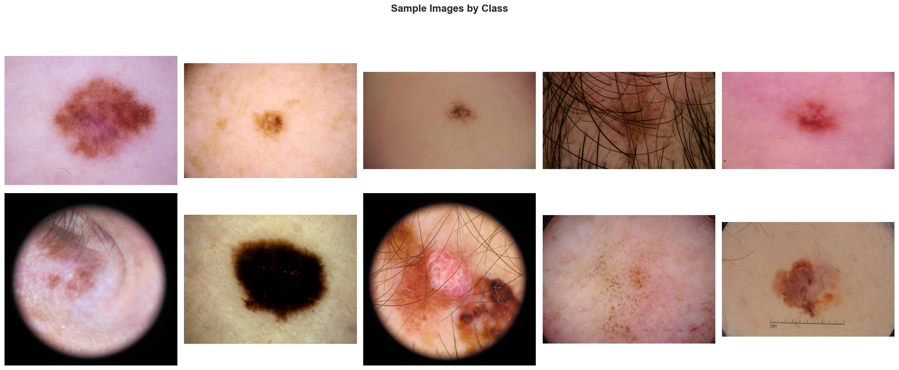

# Melanoma Classification Using Deep Learning

A multimodal deep learning approach for automated melanoma detection from dermoscopic images, combining visual features with patient metadata.

---

## What's New (February 2026)

- **Multi-Model Ensemble**: Added EfficientNet-B3, EfficientNet-B4, and ResNeSt50 backbones
- **Cross-Validation**: Implemented multi-fold training for robust evaluation
- **Ensemble Predictions**: Combined predictions from multiple models for improved accuracy
- **Updated Visualizations**: Regenerated sample images, image properties, and target distribution plots

> **Note**: Model weights (`.pth` files) are excluded from git due to size constraints. Train locally or download from releases.

---

## Table of Contents

- [Overview](#overview)
- [Dataset](#dataset)
- [Model Architecture](#model-architecture)
- [Results](#results)
- [Project Structure](#project-structure)
- [Installation](#installation)
- [Usage](#usage)
- [Visualizations](#visualizations)
- [References](#references)

---

## Overview

Melanoma is the deadliest form of skin cancer, accounting for 75% of skin cancer deaths. Early detection significantly improves survival rates, with 5-year survival exceeding 99% when caught early versus less than 25% for late-stage detection.

This project implements an automated melanoma classification system using:

- **EfficientNet-B1** backbone pretrained with Noisy Student
- **Multimodal fusion** of image features and patient metadata
- **Multi-sample dropout** for robust predictions
- **Test Time Augmentation (TTA)** for improved inference

### Key Results

| Metric | Value |
|--------|-------|
| Validation AUC | **0.9504** |
| Sensitivity (Recall) | 90.4% |
| Specificity | 86.7% |
| Total Samples | 58,457 |

---

## Dataset

We merged two ISIC (International Skin Imaging Collaboration) datasets to address class imbalance:

| Dataset | Samples | Malignant Cases | Malignant Rate |
|---------|---------|-----------------|----------------|
| ISIC 2020 | 33,126 | 584 | 1.76% |
| ISIC 2019 | 25,331 | 4,522 | 17.85% |
| **Combined** | **58,457** | **5,106** | **8.74%** |

### Why Merge Datasets?

The ISIC 2020 dataset alone had only 584 malignant cases (1.76%), making it extremely difficult to train a robust model. By incorporating ISIC 2019 data, we increased positive samples by 8.7x.

### Data Sources

- [SIIM-ISIC Melanoma Classification (2020)](https://www.kaggle.com/c/siim-isic-melanoma-classification)
- [ISIC 2019 Challenge Dataset](https://challenge.isic-archive.com/data/)

---

## Model Architecture

```
Input Image (256x256x3)
        |
        v
EfficientNet-B1 Backbone (ImageNet Pretrained)
        |
        v
Image Features (1280 dim)
        |                          Meta Features (11 dim)
        |                                |
        |                          FC -> BN -> SiLU -> Dropout
        |                          FC -> BN -> SiLU
        |                                |
        |                          Meta Embedding (128 dim)
        |                                |
        +-------- CONCATENATE -----------+
                      |
              Combined Features (1408 dim)
                      |
              Multi-Sample Dropout (5x)
                      |
              Final Prediction (Sigmoid)
```

### Meta Features Used (11 total)

- `sex` - Patient sex (binary encoded)
- `age_approx` - Patient age (normalized 0-1)
- `n_images` - Images per patient (log normalized)
- `image_size` - File size (log normalized)
- `site_*` - Anatomic location (7 one-hot columns)

### Anti-Overfitting Techniques

| Technique | Configuration |
|-----------|---------------|
| Label Smoothing | 0.05 |
| Weight Decay | 0.01 |
| Multi-Sample Dropout | 5 passes, 50% rate |
| Early Stopping | Patience = 4 epochs |
| Cosine Annealing LR | With 1 epoch warmup |

---

## Results

### Training Progress


*Training loss decreases while validation AUC peaks at epoch 4. Early stopping prevents overfitting.*

### Class Distribution


*91.3% benign vs 8.7% malignant cases in the merged dataset.*

### Patient Demographics


*Distribution of age and sex across the dataset.*

### Feature Correlations


*Correlation matrix showing relationships between features and malignancy.*

### Error Analysis


*Error rate breakdown by age group, sex, and prediction confidence.*

### Misclassified Samples

| False Negatives (Missed Melanomas) | False Positives (False Alarms) |
|:----------------------------------:|:------------------------------:|
|  |  |

### Test Set Predictions


*Distribution of malignancy predictions on the test set.*

---

## Project Structure

```
Melanoma_classification_multimodal/
|
|-- src/
|   |-- melanoma_classification.ipynb   # Main training notebook
|   |-- merge_datasets.py               # Dataset merging script
|   |-- requirements.txt                # Python dependencies
|
|-- Output/
|   |-- model_fold*.pth                 # Trained model weights (not in git)
|   |-- effnet_b3_fold*.pth             # EfficientNet-B3 weights
|   |-- effnet_b4_fold*.pth             # EfficientNet-B4 weights
|   |-- resnest50_fold*.pth             # ResNeSt50 weights
|   |-- submission.csv                  # Single model submission
|   |-- submission_ensemble.csv         # Ensemble submission
|   |-- training_curves.png             # Training visualization
|   |-- target_distribution.png         # Class balance plot
|   |-- metadata_analysis.png           # Demographics analysis
|   |-- feature_correlation.png         # Feature importance
|   |-- error_analysis.png              # Error breakdown
|   |-- false_negatives.png             # Missed melanoma samples
|   |-- false_positives.png             # False alarm samples
|   |-- test_predictions_distribution.png
|
|-- docs/
|   |-- Melanoma_Classification_Report.md   # Detailed project report
|   |-- Melanoma_Classification_Report.html
|
|-- Data/                               # (Not included - download separately)
|   |-- train.csv
|   |-- test.csv
|   |-- train_merged_master.csv
|   |-- jpeg/
|       |-- train/
|       |-- test/
|
|-- README.md
```

---

## Installation

### Prerequisites

- Python 3.8+
- CUDA-capable GPU (recommended)
- 16GB+ RAM

### Setup

1. Clone the repository:
```bash
git clone https://github.com/PirMustafa/Melanoma_classification_multimodal.git
cd Melanoma_classification_multimodal
```

2. Create a virtual environment:
```bash
python -m venv venv
source venv/bin/activate  # Linux/Mac
venv\Scripts\activate     # Windows
```

3. Install dependencies:
```bash
pip install -r src/requirements.txt
```

4. Download the datasets:
   - [ISIC 2020 Dataset](https://www.kaggle.com/c/siim-isic-melanoma-classification/data)
   - [ISIC 2019 Dataset](https://challenge.isic-archive.com/data/)

5. Place datasets in the `Data/` folder following the structure above.

---

## Usage

### 1. Merge Datasets

```bash
python src/merge_datasets.py
```

This creates `train_merged_master.csv` with combined 2019+2020 data.

### 2. Train the Model

Open `src/melanoma_classification.ipynb` in Jupyter and run all cells:

```bash
jupyter notebook src/melanoma_classification.ipynb
```

### 3. Generate Predictions

The notebook will automatically:
- Train the model with early stopping
- Generate visualizations in `Output/`
- Create `submission.csv` for Kaggle

---

## Training Configuration

```python
MODEL_NAME = 'tf_efficientnet_b1_ns'
IMAGE_SIZE = 256
BATCH_SIZE = 128
EPOCHS = 15
LEARNING_RATE = 2e-4
WEIGHT_DECAY = 0.01
LABEL_SMOOTHING = 0.05
NUM_WORKERS = 4
```

---

## Visualizations

### Sample Images



*Example dermoscopic images from the dataset.*

### Image Properties


*Distribution of image file sizes (proxy for complexity).*

---

## Technical Details

### Data Augmentation (Training)

- Random horizontal/vertical flips
- Random rotation (90 degrees)
- ShiftScaleRotate
- HueSaturationValue
- RandomBrightnessContrast
- Cutout (CoarseDropout)

### Test Time Augmentation

4x TTA with horizontal and vertical flips for robust predictions.

### Loss Function

Binary Cross-Entropy with:
- Label smoothing (0.05)
- Positive class weighting (10.45x)

---

## Performance Notes

- Training time: approximately 1-2 hours per fold on RTX 3060/5060
- GPU memory usage: approximately 8GB with batch size 128
- Disk space for datasets: approximately 30GB

---

## Future Improvements

1. Train full 5-fold ensemble (+0.02-0.03 AUC expected)
2. Use larger backbone (EfficientNet-B4)
3. Add external datasets (ISIC 2018, HAM10000)
4. Experiment with Vision Transformers
5. Implement GradCAM visualizations for interpretability

---

## References

1. SIIM-ISIC Melanoma Classification Challenge, Kaggle 2020
2. Tan, M., & Le, Q. (2019). EfficientNet: Rethinking Model Scaling for CNNs
3. Codella, N., et al. (2019). Skin Lesion Analysis Toward Melanoma Detection
4. Gessert, N., et al. (2020). Skin Lesion Classification Using CNNs With Attention

---

## License

This project is for educational and research purposes.

---

## Author

Pir Ghullam Mustafa - February 2026
